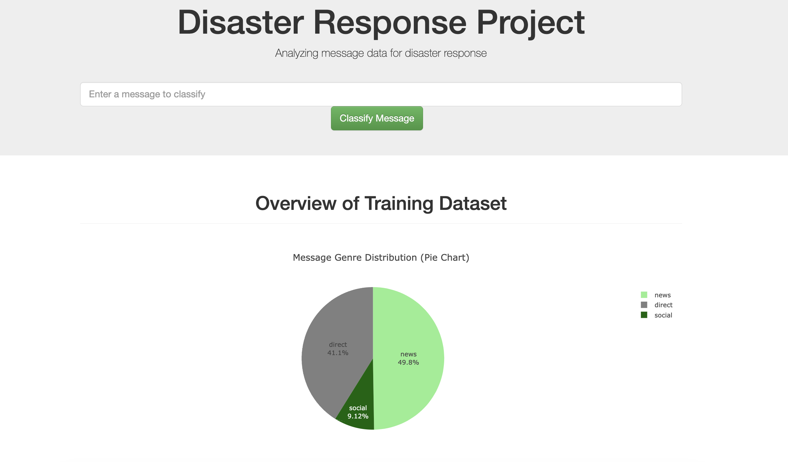
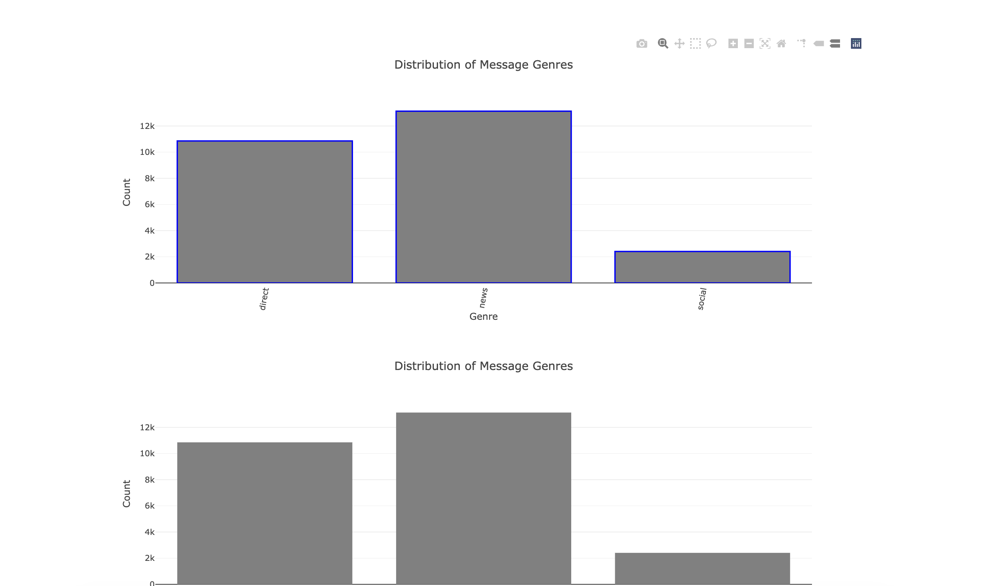

# Disaster Response Pipeline Project
Machine Learning Web Application to Extract, Transform and Load (ETL) Twitter Messages into an SQL database and classify messages into response categories for Disaster Response Organisations during Disasters.




### Getting Started:
1. **To run the python scripts.**
   
   Create a virtual environment to manage application dependencies.
   
    ```
	python3 -m venv myenv  
    ```
    ```
	source myenv/bin/activate
    ```
    ```
	pip install -r requirements.txt
    ```
    ```
	python app.py
	```


### Instructions:
1. Run the following commands in the project's root directory to set up your database and model.

    - To run ETL pipeline that cleans data and stores in database
        ```
        python data/process_data.py data/disaster_messages.csv data/disaster_categories.csv data/DisasterResponse.db
        
        ```
    - To run ML pipeline that trains classifier and saves
        ```
        python models/train_classifier.py data/DisasterResponse.db models/classifier.pkl
        
        ```

2. Run the following command in the app's directory to run your web app.
    `python run.py`

3. Go to http://127.0.0.1:3001/ or http://0.0.0.0:3001/


## Project Files Overview

data
- There is a process data script with a program to extract data from csv files and load into a pandas data frame, clean and transform the data into a dataset for a machine learning model to classify messages into the appropriate disaster response category.
- This makes use of helper functions such as
- -  load_data
- - save_data


models

- There is a train_classifier script with a program to fetch the cleaned data from an sqlite database, load into a pandas data frame and split into training and tests set for a machine learning model to classify messages into the appropriate disaster response category.
- - Tokenize
- -  Starating Verb Extractor
- - save model as a pickel file
- - build_model
- - 

workspace
Jupyter notebooks with functions in cells to perform little experiments before running main program scripts for ETL or ML pipeline.

tests
- Actively in development, unit testing scripts for future development support.