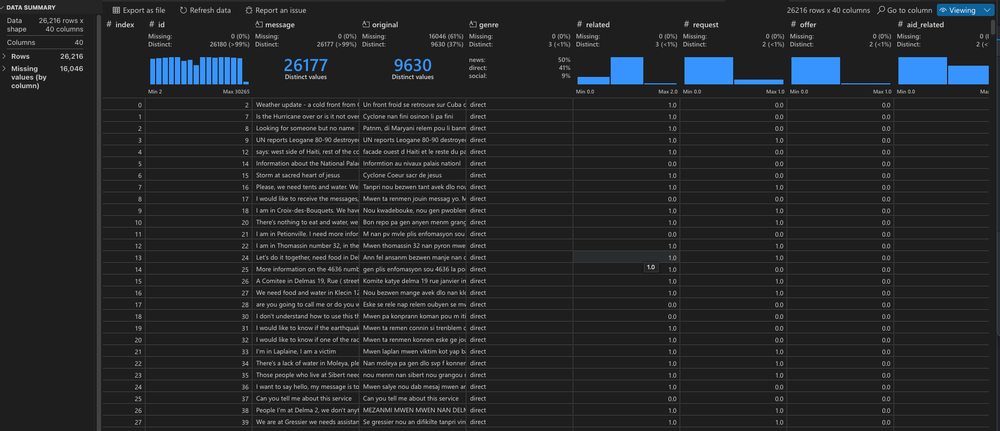
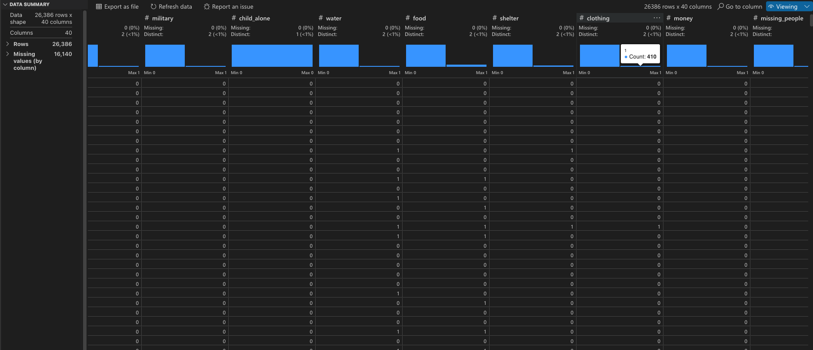

# Disaster Response Pipeline Project 🚨

A Machine Learning Web Application that processes Twitter messages during disasters, categorizing them to help Response Organizations efficiently direct aid. The system performs Extract, Transform and Load (ETL) operations on messages and classifies them into relevant emergency response categories.

## Dashboard Preview


## Quick Start

### Prerequisites

- Python 3.6+
- pip package manager

### Installation

1. **Create and activate a virtual environment**
   ```bash
   # Create virtual environment
   python3 -m venv myenv
   
   # Activate virtual environment
   # On Unix/macOS:
   source myenv/bin/activate
   # On Windows:
   myenv\Scripts\activate
   ```

2. **Install dependencies**
   ```bash
   pip install -r requirements.txt
   ```

3. **Set up the database and train the model**
   ```bash
   # Process data and create database
   python data/process_data.py data/disaster_messages.csv data/disaster_categories.csv data/DisasterResponse.db
   
   # Train and save the classifier
   python models/train_classifier.py data/DisasterResponse.db models/classifier.pkl
   ```

4. **Launch the web application**
   ```bash
   python app/run.py
   ```

5. **Access the application**
   - Open your browser and navigate to: http://127.0.0.1:3001/ or http://0.0.0.0:3001/

## Project Structure

### Data Processing (`data/`)
The ETL pipeline (`process_data.py`) handles:
- Loading data from CSV files
- Merging messages and categories datasets
- Cleaning and transforming data
- Storing processed data in SQLite database

Key functions:
- `load_data()`: Data extraction from CSV
- `save_data()`: Database storage operations

### Machine Learning Pipeline (`models/`)
The ML pipeline (`train_classifier.py`) includes:
- Data loading from SQLite database
- Text processing and feature engineering
- Model training and evaluation
- Model persistence (pickle format)

Key components:
- Custom tokenizer with NLTK
- StartingVerbExtractor feature
- Multi-output classification pipeline
- GridSearchCV for hyperparameter tuning

### Web Application (`app/`)
Flask-based web interface providing:
- Interactive message classification
- Data visualizations
- Real-time prediction results

## Dataset Analysis


<br><br>



### Class Imbalance Considerations
The dataset exhibits significant class imbalance, particularly in categories like 'water' and 'child alone' which has all zeros. This presents several challenges:

- **Training Impact**: Underrepresented classes may have lower prediction accuracy
- **Metric Selection**: F1-score provides a balanced measure for imbalanced classes
- **Strategy**: Model evaluation emphasizes:
  - High recall for critical categories (e.g., medical help)
  - High precision for resource allocation categories

## Future Enhancements

- [ ] Additional web app visualizations
- [ ] Organization recommendation system
- [ ] UI/UX improvements
- [ ] Cloud deployment
- [ ] Pipeline optimization
- [ ] Enhanced handling of class imbalance eg using class weights in the ML training pipeline.
- [ ] Integration with disaster response organizations

## 🧪 Testing

Run the test suite (In development):
```bash
python -m tests/test_data_processing.py
python -m tests/test_train_classifier.py
```

## 📝 Development Notes

The `workspace/` directory contains Jupyter notebooks used for:
- Experimental feature development
- Pipeline prototyping
- Model evaluation
- Visualization testing

---
*This project is actively maintained and welcomes contributions.*
